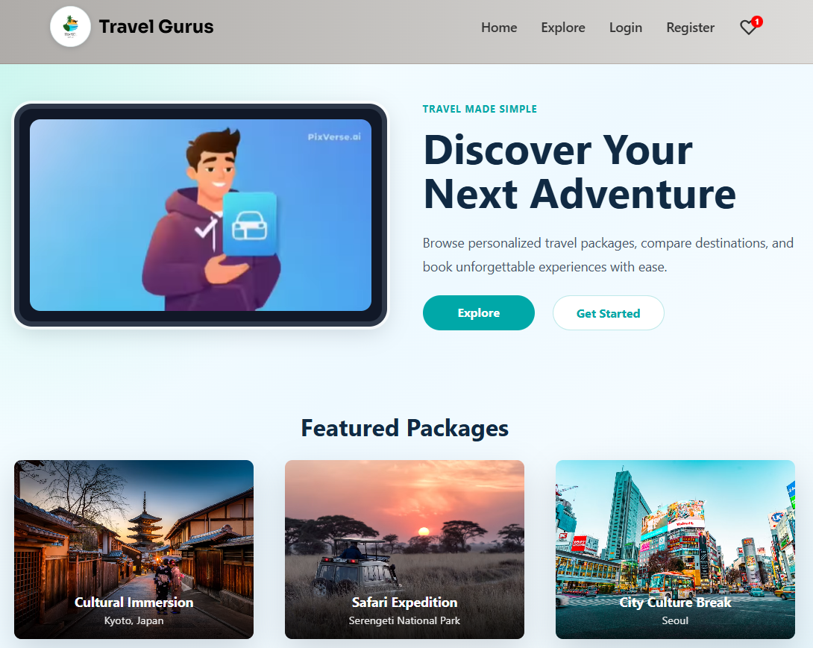
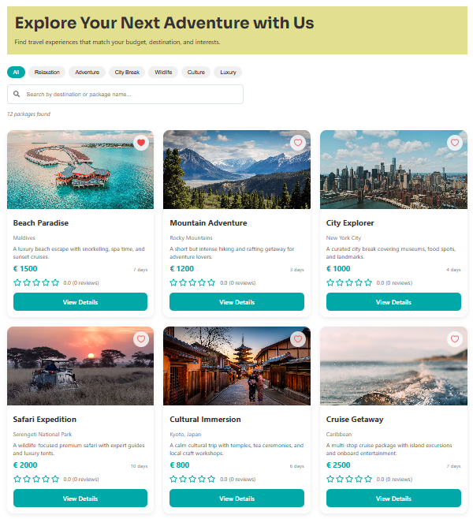
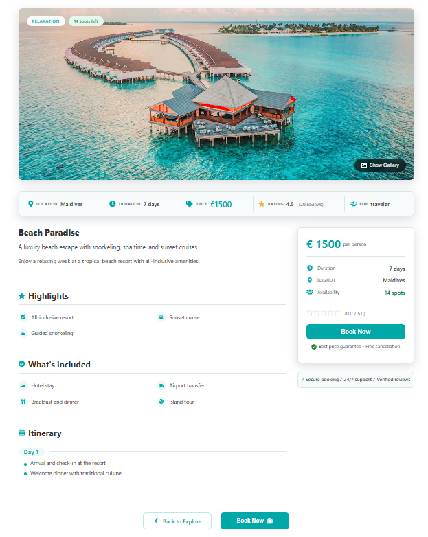
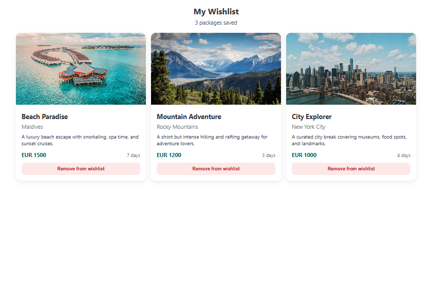
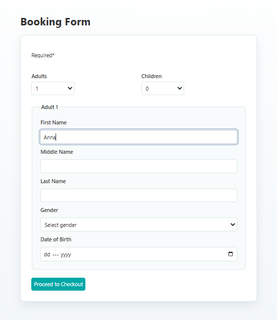
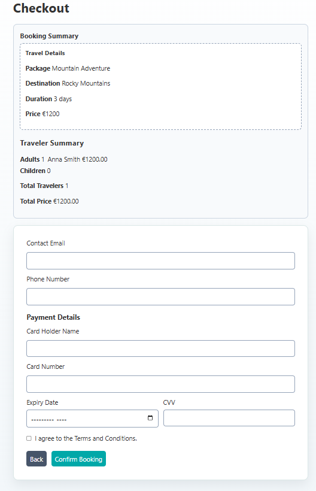
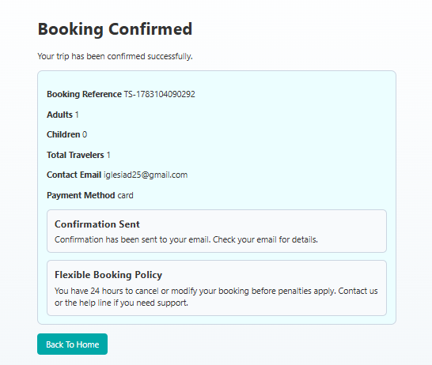
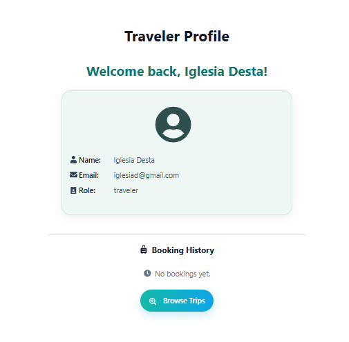

# 🌍✈ Travel Guru

🔗 Live Demo: https://travel-sync-self.vercel.app/

Travel Guru is a full-stack web application developed as the final project for the Hack Your Future program. It simulates a modern travel booking platform where users can discover travel packages, explore destinations, save their favorite trips to a wishlist, and complete a booking journey from traveler information to booking confirmation.

---

# ✨ Features

### Traveler

- Register and log in using Firebase Authentication
- View traveler profile
- Explore travel packages
- Search and filter packages
- View detailed package information including itinerary and image gallery
- Save and remove packages from the wishlist
- Complete group and individual bookings
- Review booking summary during checkout
- Receive a booking confirmation

### Business

- Register and log in as a business user (in progress)
- Basic business dashboard (in progress)

---

# 🛠 Tech Stack

### Frontend

- React
- Vite
- React Router
- CSS

### Backend

- Node.js
- Express

### Authentication & Database

- Firebase Authentication
- Firestore

### API

- CrudCrud (Packages and Wishlist)

---

# 📁 Project Structure

```text
app/
├── src/
│   ├── assets/
│   ├── components/
│   ├── context/
│   ├── pages/
│   ├── routes/
│   ├── services/
│   └── utils/
├── public/
├── index.html
└── package.json
```

---

# 📄 Pages

- Home
- Explore
- Package Details
- Booking Form
- Checkout
- Confirmation
- Wishlist
- Login
- Register
- Traveler Profile

---

# 🚀 How to Run

### Frontend

Navigate to the project folder and install the dependencies:

```bash
npm install
```

Start the development server:

```bash
npm run dev
```

### Backend (Optional)

Navigate to the `api` folder.

Install dependencies:

```bash
npm install
```

Run the backend server:

```bash
npm run dev
```

**Note:** The current application uses **Firebase** for authentication and **CrudCrud** for package and wishlist data, so the frontend can run without starting the local backend.

---

# 🔑 Environment Variables

### Frontend (`.env.local`)

```env
VITE_CRUD_CRUD_API_KEY=your-crudcrud-api-key

VITE_FIREBASE_API_KEY=
VITE_FIREBASE_AUTH_DOMAIN=
VITE_FIREBASE_PROJECT_ID=
VITE_FIREBASE_STORAGE_BUCKET=
VITE_FIREBASE_MESSAGING_SENDER_ID=
VITE_FIREBASE_APP_ID=
```

### Backend (`api/.env`)

```env
PORT=3001
CRUD_CRUD_API_KEY=your-crudcrud-api-key
```

---

# 📌 Current Status

✅ Firebase Authentication

✅ Firestore user profiles

✅ Explore page with search and filtering

✅ Package detail page

✅ Wishlist functionality

✅ Booking flow

✅ Checkout summary

✅ Booking confirmation

✅ Responsive layout

✅ CrudCrud integration for packages and wishlist

---

# 🎯 Goal of the Project

The goal of Travel Guru is to practice modern full-stack web development by building a realistic travel booking application. Throughout the project, we focused on:

- Building a responsive and consistent user interface
- Creating reusable React components
- Implementing client-side routing
- Managing application state with React Context
- Integrating Firebase Authentication and Firestore
- Working with external APIs using CrudCrud
- Applying collaborative Git and GitHub workflows

---

# 📸 Project Preview

| Home                                                            | Explore                                                                |
| --------------------------------------------------------------- | ---------------------------------------------------------------------- |
|  |  |

| Package Details                                                                 | Wishlist                                                             |
| ------------------------------------------------------------------------------- | -------------------------------------------------------------------- |
|  |  |

| Booking                                                               | Checkout                                                                |
| --------------------------------------------------------------------- | ----------------------------------------------------------------------- |
|  |  |

| Confirmation                                                                    | Profile                                                           |
| ------------------------------------------------------------------------------- | ----------------------------------------------------------------- |
|  |  |

# 🚧 Future Improvements

- Business package management
- Business profile and page
- Booking history
- Advanced booking search dashboard
- Improve (Dynamic)homepage content
- Customer reviews and rating
- Online payment integration
- Improved accessibility
- SEO optimization
- Performance improvements

---

# 👥 Authors

Built as a final project by a Hack Your Future student team: Abbas, Emebet, and Iglesia, using React, Vite, Firebase, Express, and CrudCrud.
